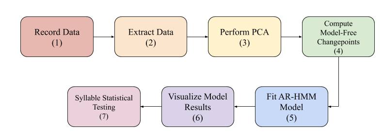

# Usage Manual

## Get Started
In order to view the jupyter notebook walkthroughs: 
 1. Clone this repository to your local machine.
 2. Navigate to this directory: moseq2-docs/usage-docs
 3. Run command: jupyter notebook
 
A webpage will open listing the jupyter notebooks.

If you don't have jupyter installed, run:
pip install jupyter

Or follow this link to the jupyter installation website: https://jupyter.org/install.html

## Notebook Step Guide
- Step 0: Glossary
- Step 1: Extract
- Step 2: PCA
- Step 3: PCA: Compute Changepoints
- Step 4: Model
- Step 5: Viz
- Step 6: Statistical Analysis

## Pipeline

